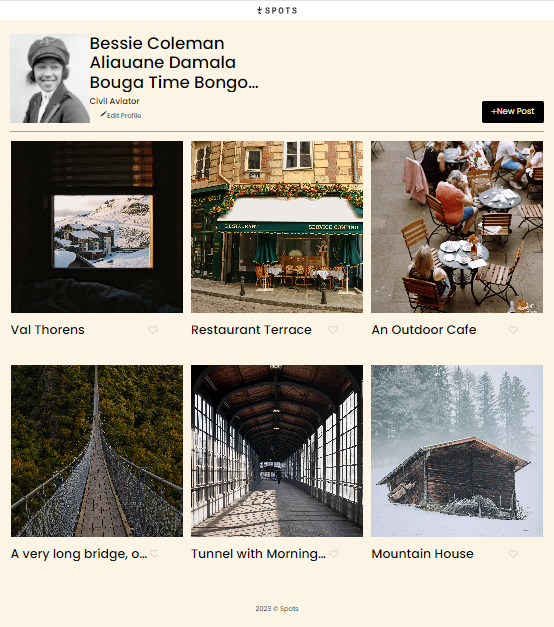

# Project 3: Spots

This is an image sharing site.

## Project Overview

The se-project-spots is the third project of the Software Engineering program at TripleTen. The main idea of the project is to create a responsive site which responds to the user's behavior based on screen size, platform and orientation. I created this site using HTML and CSS, based on the design brief.

## Project Functionality

This project is made so all the elements are displayed correctly on popular screen sizes. I worked with a Figma design which provides layouts for mobile (320px) and desktop (1440px). I used responsive design techniques to make the website responsive, which means the conttent area's width will change based on the browser window's width, and eliminate horizontal scrolling to ensure it appears good on all devices.

If the user has a big screen more than 1440px the only thing that changes, the margins on the side will get bigger and I accomplished this not by setting explicit margins but I use auto margin to center page and restrict the content area and restricts the size of the elements so they don't go beyond a certain point

## Tech Stack

- Semantic HTML5
- CSS
- Figma
- Responsive Design

## Description of Technologies

Responsive sites use flexible grids, responsive images, and CSS media queries to adapt layout and content to any screen size or device, ensuring optimal viewing across desktops, tablets, and smartphones.

### Semantic HTML5

refers to the use of HTML5 elements that provide meaning to the structure and content of a webpage, making it easier for search engines, screen readers, and other tools to understand the context and organization of the content. Semantic HTML 5 focuses on: 1. descriptive element names (e.g. header, nav, main, section, footer) 2. clear hierarchy and organization 3. meaningful relationships betwwen elements

### CSS

Cascading Style Sheets (CSS) is a crucial coding language in web development that governs the aesthetic and layout aspects of web pages. By utilizing CSS, developers can effectively add and manage various design elements, including:
•⁠ ⁠Color schemes and palettes
•⁠ ⁠Font styles and typography
•⁠ ⁠Spacing and padding
•⁠ ⁠Layout and grid systems
•⁠ ⁠Visual effects, such as animations and transitions

### Figma

Figma is a cutting-edge, cloud-based design platform that empowers individuals or businesses to craft exceptional digital products and experiences. By providing a centralized hub for creation, sharing, and testing, Figma fosters seamless collaboration among diverse stakeholders, including:
•⁠ ⁠Designers
•⁠ ⁠Product managers
•⁠ ⁠Writers
•⁠ ⁠Developers

Figma's intuitive interface facilitates real-time feedback, efficient decision-making, and accelerated project delivery, making it an indispensable tool for teams driving digital innovation.

### Responsive Design

Responsive web design is a comprehensive methodology that enables websites to intelligently respond to different display environments, guaranteeing effortless navigation and engagement across:
•⁠ ⁠Various devices (desktops, laptops, tablets, smartphones)
•⁠ ⁠Multiple screen sizes and resolutions
•⁠ ⁠Changing orientations (landscape, portrait)

This adaptable strategy encompasses various techniques, including adaptive design, to deliver cohesive, visually appealing, and user-friendly digital experiences

## Description of Techniques Used

In the process of building this website, I:
• Work with designs in a graphics editor called Figma
• Create responsive websites using grid layout
• Use media queries to set parameters for different screen sizes (desktop, tablets, phones)
• Work more efficiently with Git and the command line

The site was designed to provide an optimal viewing experience across a wide range of devices, including desktops, tablets, and smartphones. By utilizing advanced technologies such as:
. flexible grids based on relative units (percentages)
. responsive images that scale with the layout
. CSS media queries that apply styles based on device characteristics

All media queries are set at a max of 627px

## Screenshots

**Video**

- [Link to the project video](https://www.loom.com/share/daa6563f49a64e439be569b09fa22bd8?sid=087e448c-918d-45e9-b322-4aed8c3699f9)

## Deployment

This webpage is deployed to GitHub Pages

- Deployment Link:
